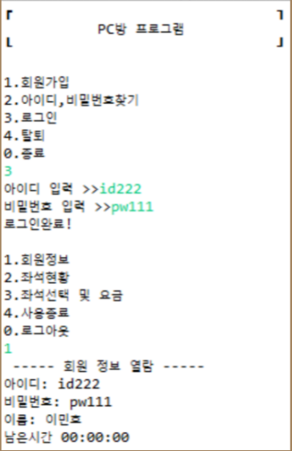
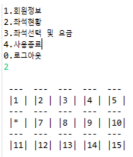
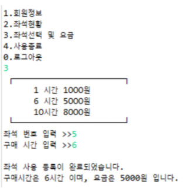
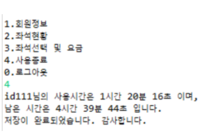

# 🖥️ Java+DB PC프로젝트
- <b>Language</b> : 
- <b>Database</b> : 
- <b>Tool</b> : 
- 자바 콘솔로만 작동하는 프로그램입니다.

## 🔖제작기간 및 개발인원
- 기간 : 2021.10 ~ 2021.10 (약 1주)
- 인원 : 1명 (개인프로젝트)

## 🔖주요 기능

### 🔸 메인메뉴
- <b>메뉴 선택</b> : 메뉴만 출력해주는 메소드를 따로 만들어 필요할때마다 출력함
- <b>회원가입 / 로그인 / 로그아웃 / 정보수정</b> : 회원 관련 기능, 로그인 이후 예매 기능 사용가능
- <b>ID/PW 찾기</b> : ID는 이름 검색으로, PW는 ID 검색으로 찾을 수 있습니다.



<details>
<summary>코드보기</summary>
<div markdown="1">

```java
// 아이디, 비밀번호찾기
int findInfo = 0;
System.out.println("1.아이디찾기");
System.out.println("2.비밀번호찾기");
findInfo = sc.nextInt();
dtos = service.getAllMember();
if (findInfo == 1) {
	System.out.print("찾으려는 아이디의 이름 입력 >>");
	name = sc.next();
	for (int i = 0; i < dtos.size(); i++) {
		if (dtos.get(i).getName().equals(name)) {
			System.out.print("아이디는 [" + dtos.get(i).getID() + "] 입니다.");
			System.out.println();
		}
	}
} else if (findInfo == 2) {
	System.out.print("아이디 입력 >>");
	id = sc.next();
	for (int i = 0; i < dtos.size(); i++) {
		if (dtos.get(i).getID().equals(id)) {
			System.out.print("비밀번호는 [" + dtos.get(i).getPW() + "] 입니다.");
			System.out.println();
		}
	}
}
	
        
//메인메뉴
	public static void Menu() {
		System.out.println();
		System.out.println("1.회원가입");
		System.out.println("2.아이디,비밀번호찾기");
		System.out.println("3.로그인");
		System.out.println("4.탈퇴");
		System.out.println("0.종료");

	}
```
	
</div>
</details>

<br>

### 🔸서브메뉴
- 메인메뉴에서 로그인하면 서브메뉴로 들어옵니다.
- <b>좌석 현황</b> : 데이터베이스에서 좌석현황을 불러와 사용중인 좌석이라면 | * |로 표기됩니다.



<details>
<summary>코드보기</summary>
<div markdown="1">

```java
//서브메뉴
	public static void subMenu() {
		System.out.println();
		System.out.println("1.회원정보");
		System.out.println("2.좌석현황");
		System.out.println("3.좌석선택 및 요금");
		System.out.println("4.사용종료");
		System.out.println("0.로그아웃");
	}
  
//좌석 현황
int seat = 0;
dtos2 = service2.getAllPcInfo();
for (int i = 0; i < dtos2.size(); i++) {
	seat = dtos2.get(i).getSeat();
	if (i % 5 == 0) { // 콘솔창 줄바꿈
		System.out.println();
		System.out.println(" ---  ---  ---  ---  ---  ");
	}
	if (dtos2.get(i).getID() != null) { // pc 좌석이 사용중이라면 *출력
		System.out.print(" |* |");
	} else {
		if (i < 9) {
			System.out.print(" |" + seat + " |");
		} else {
			System.out.print(" |" + seat + "|");
			}
		}
	}
```
	
</div>
</details>

#### 🔸 좌석 선택 및 시간 구매
- 좌석 선택 후 시간 구매를 할 때 현재 시간을 받아서 계산해 종료시간을 DB에 저장합니다.
- 만약 이전에 사용하고 남은 시간이 있다면 합해서 총 잔여 시간을 출력합니다.
- 사용중인 좌석을 선택한다면 이전 메뉴로 돌아갑니다.




```java
for (int i = 0; i < dtos.size(); i++) {
	if (dtos.get(i).getID().equals(loginId)) {
	if (dtos.get(i).getRemainTime() != null) { // 로그인 id에 잔여시간이 있다면
		String rmHour = dtos.get(i).getRemainTime().substring(11, 13);
		String rmMinute = dtos.get(i).getRemainTime().substring(14, 16);
		String rmSecond = dtos.get(i).getRemainTime().substring(17, 19);

		System.out.println("잔여시간은 " + rmHour + "시간 " + rmMinute + "분 " + rmSecond + "초 입니다.");
            //남은 잔여시간 출력

		remainHour = Integer.parseInt(rmHour); //int로 변환
		remainMinute = Integer.parseInt(rmMinute);
		remainSecond = Integer.parseInt(rmSecond);

		nowHour = nowHour + remainHour; // 현재시간에 잔여시간을 더해 변수에 저장->종료 
		nowMinute = nowMinute + remainMinute;
		nowSecond = nowSecond + remainSecond;
            
            
            String endTime = buyHour + ":" + nowMinute + ":" + nowSecond;
```

#### 🔸 사용 종료
- 사용자의 시작 시간에서 현재 시간을 뺀 후 사용 시간을 계산합니다.
- 최종 잔여 시간에서 사용 시간을 뺀 후 DB에 저장합니다.



```java
LocalDateTime UseNow = LocalDateTime.now();
nowHour = UseNow.getHour(); // 현재 시(Hour)만 추출
nowMinute = UseNow.getMinute();
nowSecond = UseNow.getSecond();

stHour = Math.abs(stHour - nowHour); // 시작시간에서 현재시간을 빼서 사용시간 추출
stMinute = Math.abs(stMinute - nowMinute); //현재시간 계산 시 날짜가 바뀌면 음수 값이 나올 수 있기 때문에 절댓값으로 계산
stSecond = Math.abs(stSecond - nowSecond);

rmHour = rmHour + buyTime; // 기존 ID에 남아잇던 잔여시간에 구매시간을 더한다

TotalRMHour = Math.abs(rmHour - stHour -1); // 더한 잔여시간에서 사용시간을 빼면 사용후 남은시간
TotalRMMinute = Math.abs(rmMinute - stMinute); 
TotalRMSecond = Math.abs(rmSecond - stSecond);

String remainTime = TotalRMHour + ":" + TotalRMMinute + ":" + TotalRMSecond;

System.out.println(loginId + "님의 사용시간은 " + stHour + "시간 " + stMinute + "분 " + stSecond + "초 이며,");
System.out.println("남은 시간은 " + TotalRMHour + "시간 " + TotalRMMinute + "분 " + TotalRMSecond + "초 입니다.");
System.out.println("저장이 완료되었습니다. 감사합니다.");
dtos2 = service2.LogoutPc(useSeat);
dtos = service.SaveTime(loginId, remainTime);
```

# 😘 감사합니다.
